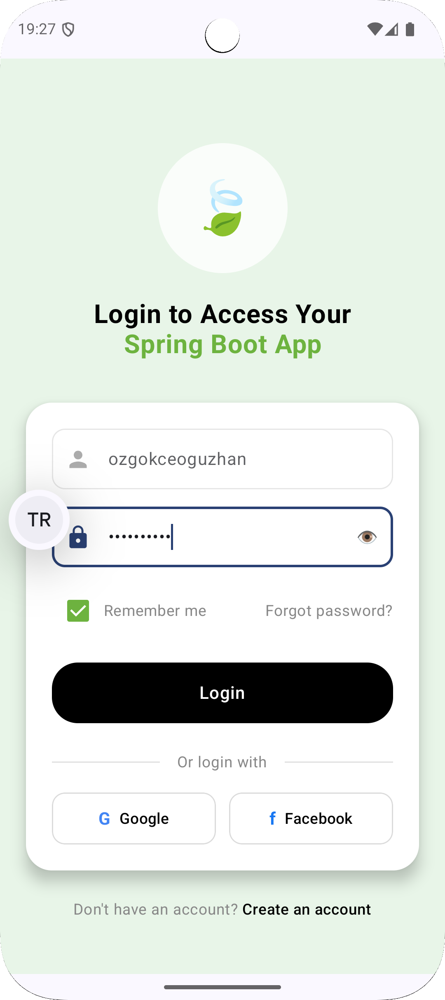
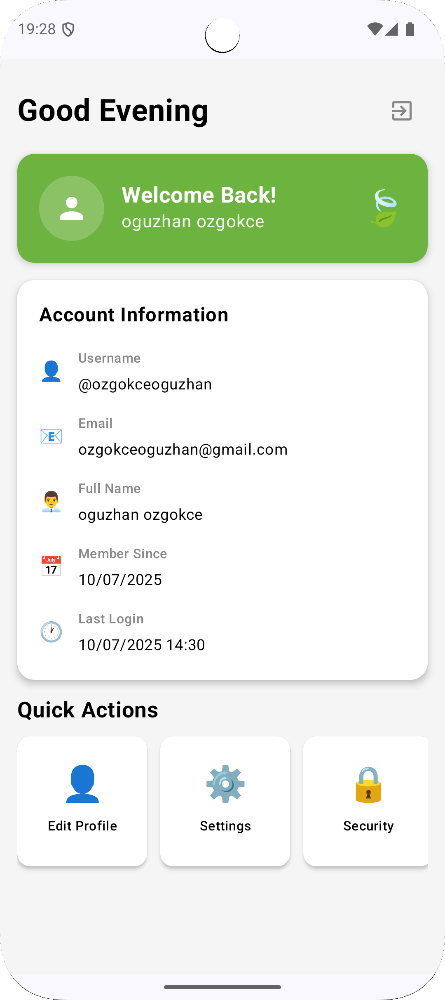

# BootMobileSecure

[](README.md)
[](README_TR.md)

**A modern, secure Android application built with Spring Boot backend integration**


---

## Overview

BootMobileSecure is a production-ready Android application showcasing modern mobile development
practices with enterprise-grade security features. Built with **Kotlin**, **Jetpack Compose**, and *
*Clean Architecture**, it provides seamless integration with Spring Boot backends.

### Backend Integration

This Android application is designed to work with a custom **Spring Boot backend** that I developed.
The backend handles:

- **User Authentication & Authorization** with JWT tokens
- **Database Operations** with JPA/Hibernate
- **Security Configuration** with Spring Security
- **RESTful APIs** for all client operations
- **User Registration & Login** endpoints

**Backend Repository**: [SpringBootProject](https://github.com/oguzhanozgokce/SpringBootProject)

*Check out the backend project to see the complete server-side implementation with database models,
security configurations, and API endpoints.*

### Key Features

- **Enterprise Security**: Hardware-backed encryption with Android Keystore
- **Modern UI**: Beautiful Material Design 3 with Jetpack Compose
- **Clean Architecture**: MVVM + Repository pattern with Dependency Injection
- **Network Safety**: Professional error handling and retry mechanisms
- **Auto Token Management**: Secure JWT handling with automatic refresh
- **Type Safety**: Full Kotlin coroutines with Result-based error handling

---

## Architecture

```
BootMobileSecure
├── UI Layer (Compose)
│   ├── Screens (Login, Register, Home)
│   ├── Components (Reusable UI)
│   └── ViewModels (MVI Pattern)
├── Domain Layer
│   ├── Repositories (Interfaces)
│   └── Use Cases
├── Data Layer
│   ├── Repository Implementations
│   ├── Network (Retrofit + OkHttp)
│   ├── Security (TokenManager)
│   └── Models (DTOs)
└── DI (Hilt)
```

### Design Patterns

- **MVI (Model-View-Intent)**: Unidirectional data flow
- **Repository Pattern**: Clean data layer abstraction
- **Dependency Injection**: Hilt for loose coupling
- **Result Pattern**: Type-safe error handling

---

## Security Features

### Multi-Layer Security

1. **Hardware Security Module (HSM)**
   - Android Keystore with StrongBox support
   - Hardware-backed encryption keys
   - Tamper-resistant storage

2. **EncryptedSharedPreferences**
   - AES-256 encryption for sensitive data
   - Automatic key rotation
   - Fallback mechanisms

3. **Network Security**
   - Certificate pinning
   - Request/Response encryption
   - Automatic token refresh

```kotlin
// Secure token storage
tokenManager.saveTokensWithKeystore(
    accessToken = "jwt_token",
    refreshToken = "refresh_token",
    expiresIn = 3600
)
```

---

## Quick Start

### Prerequisites

- **Android Studio**: Hedgehog or newer
- **Minimum SDK**: API 27 (Android 8.1)
- **Target SDK**: API 35 (Android 15)
- **Kotlin**: 2.0.0+

### Installation

1. **Clone the repository**
   ```bash
   git clone https://github.com/oguzhanozgokce/BootMobileSecure.git
   cd BootMobileSecure
   ```

2. **Open in Android Studio**
   ```bash
   # Open the project in Android Studio
   # Build → Sync Project with Gradle Files
   ```

3. **Configure Backend URL**
   ```kotlin
   // In NetworkModule.kt
   BASE_URL = "http://your-backend-url:8080/api/"
   ```

4. **Run the application**
   ```bash
   # Select device/emulator and click Run
   ```

---

## Contributing

### Guidelines

1. **Fork** the repository
2. **Create** a feature branch (`git checkout -b feature/AmazingFeature`)
3. **Commit** your changes (`git commit -m 'Add some AmazingFeature'`)
4. **Push** to the branch (`git push origin feature/AmazingFeature`)
5. **Open** a Pull Request

### Code Standards

- **Kotlin coding conventions**
- **Material Design 3 guidelines**
- **Clean Architecture principles**
- **Comprehensive documentation**

---

## Author

**Oğuzhan Özgökçe**
- GitHub: [@oguzhanozgokce](https://github.com/oguzhanozgokce)
- Email: ozgokceoguzhan34@gmail.com

---

## Acknowledgments

- **Spring Boot Team** for excellent backend framework
- **Android Team** for Jetpack Compose
- **Square** for Retrofit and OkHttp
- **Google** for Material Design and Security libraries

---

## Screenshots

<div align="center">

|                           Login Screen                           |                            Register Screen                             |                          Home Screen                           |
|:----------------------------------------------------------------:|:----------------------------------------------------------------------:|:--------------------------------------------------------------:|
|  |  |  |

</div>

---

<div align="center">

**Star this repository if you found it helpful!**

[](https://github.com/oguzhanozgokce/BootMobileSecure)

</div>