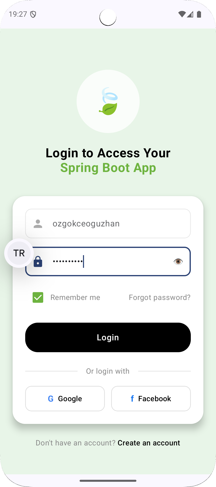
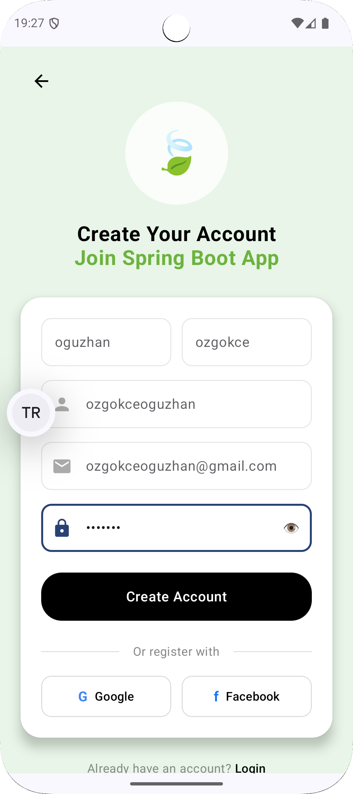
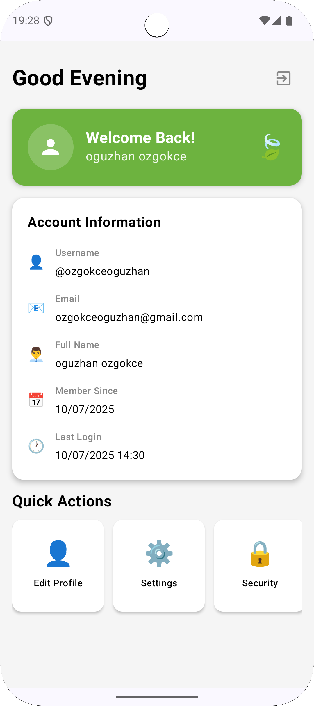

# 🛡️ BootMobileSecure

[](README.md)
[](README_TR.md)

**Spring Boot backend entegrasyonu ile geliştirilmiş modern, güvenli Android uygulaması**


---

## 📱 Genel Bakış

BootMobileSecure, kurumsal düzeyde güvenlik özellikleri ile modern mobil geliştirme uygulamalarını
sergileyen, üretime hazır bir Android uygulamasıdır. **Kotlin**, **Jetpack Compose** ve **Clean
Architecture** ile geliştirilmiş olup, Spring Boot backend'leri ile sorunsuz entegrasyon sağlar.

### 🔗 Backend Entegrasyonu

Bu Android uygulaması, geliştirdiğim özel **Spring Boot backend** ile çalışmak üzere tasarlanmıştır.
Backend şunları yönetir:

- 🔐 **Kullanıcı Kimlik Doğrulama ve Yetkilendirme** JWT token'ları ile
- 📊 **Veritabanı İşlemleri** JPA/Hibernate ile
- 🛡️ **Güvenlik Yapılandırması** Spring Security ile
- 🔄 **RESTful API'ler** tüm istemci işlemleri için
- 📝 **Kullanıcı Kaydı ve Giriş** endpoint'leri

**🌐 Backend Repository**: [SpringBootProject](https://github.com/oguzhanozgokce/SpringBootProject)

*Veritabanı modelleri, güvenlik yapılandırmaları ve API endpoint'leri ile tam sunucu tarafı
implementasyonu için backend projeyi inceleyin.*

### ✨ Temel Özellikler

- 🔐 **Kurumsal Güvenlik**: Android Keystore ile donanım destekli şifreleme
- 🎨 **Modern Arayüz**: Jetpack Compose ile güzel Material Design 3
- 🏗️ **Temiz Mimari**: Dependency Injection ile MVVM + Repository pattern
- 🌐 **Ağ Güvenliği**: Profesyonel hata yönetimi ve yeniden deneme mekanizmaları
- 🔄 **Otomatik Token Yönetimi**: Otomatik yenileme ile güvenli JWT işleme
- 🎯 **Tip Güvenliği**: Result-based hata yönetimi ile tam Kotlin coroutines

---

## 🏗️ Mimari

```
📱 BootMobileSecure
├── 🎨 UI Katmanı (Compose)
│   ├── Ekranlar (Login, Register, Home)
│   ├── Bileşenler (Yeniden Kullanılabilir UI)
│   └── ViewModels (MVI Pattern)
├── 🔄 Domain Katmanı
│   ├── Repositories (Arayüzler)
│   └── Use Cases
├── 🗄️ Data Katmanı
│   ├── Repository Implementasyonları
│   ├── Network (Retrofit + OkHttp)
│   ├── Security (TokenManager)
│   └── Models (DTOs)
└── 🔧 DI (Hilt)
```

### 🎯 Tasarım Desenleri

- **MVI (Model-View-Intent)**: Tek yönlü veri akışı
- **Repository Pattern**: Temiz veri katmanı soyutlaması
- **Dependency Injection**: Gevşek bağlantı için Hilt
- **Result Pattern**: Tip güvenli hata yönetimi

---

## 🔐 Güvenlik Özellikleri

### 🛡️ Çok Katmanlı Güvenlik

1. **Donanım Güvenlik Modülü (HSM)**
    - StrongBox desteği ile Android Keystore
    - Donanım destekli şifreleme anahtarları
    - Kurcalamaya dayanıklı depolama

2. **EncryptedSharedPreferences**
    - Hassas veriler için AES-256 şifreleme
    - Otomatik anahtar rotasyonu
    - Fallback mekanizmaları

3. **Ağ Güvenliği**
    - Certificate pinning
    - Request/Response şifreleme
    - Otomatik token yenileme

```kotlin
// Güvenli token depolama
tokenManager.saveTokensWithKeystore(
    accessToken = "jwt_token",
    refreshToken = "refresh_token",
    expiresIn = 3600
)
```

---

## 🚀 Hızlı Başlangıç

### Ön Koşullar

- **Android Studio**: Hedgehog veya daha yeni
- **Minimum SDK**: API 27 (Android 8.1)
- **Target SDK**: API 35 (Android 15)
- **Kotlin**: 2.0.0+

### 🔧 Kurulum

1. **Repository'yi klonlayın**
   ```bash
   git clone https://github.com/oguzhanozgokce/BootMobileSecure.git
   cd BootMobileSecure
   ```

2. **Android Studio'da açın**
   ```bash
   # Projeyi Android Studio'da açın
   # Build → Sync Project with Gradle Files
   ```

3. **Backend URL'sini yapılandırın**
   ```kotlin
   // NetworkModule.kt dosyasında
   BASE_URL = "http://your-backend-url:8080/api/"
   ```

4. **Uygulamayı çalıştırın**
   ```bash
   # Cihaz/emülatör seçin ve Run'a tıklayın
   # Veya: ./gradlew installDebug
   ```

---

## 🚀 Dağıtım

### 📱 Release Build

```bash
# İmzalı APK oluştur
./gradlew assembleRelease

# App Bundle oluştur (önerilen)
./gradlew bundleRelease
```

### 🔐 Güvenlik Kontrol Listesi

- [ ] ProGuard/R8 etkin
- [ ] Certificate pinning yapılandırılmış
- [ ] Debug log'ları kaldırılmış
- [ ] API anahtarları güvenli
- [ ] Donanım güvenliği doğrulanmış

---

## 🤝 Katkıda Bulunma

### 📝 Kılavuzlar

1. **Fork** edin repository'yi
2. **Oluşturun** feature branch (`git checkout -b feature/HarikaBirOzellik`)
3. **Commit** edin değişikliklerinizi (`git commit -m 'Harika bir özellik ekle'`)
4. **Push** edin branch'e (`git push origin feature/HarikaBirOzellik`)
5. **Açın** bir Pull Request

### 📋 Kod Standartları

- **Kotlin kodlama kuralları**
- **Material Design 3 kılavuzları**
- **Clean Architecture prensipleri**
- **Kapsamlı dokümantasyon**

---

## 📄 Lisans

Bu proje **MIT Lisansı** altında lisanslanmıştır - detaylar için [LICENSE](LICENSE) dosyasına bakın.

---

## 👨‍💻 Yazar

**Oğuzhan Özgökçe**

- GitHub: [@oguzhanozgokce](https://github.com/oguzhanozgokce)
- Email: oguzhan33@gmail.com

---

## 🙏 Teşekkürler

- **Spring Boot Ekibi** mükemmel backend framework için
- **Android Ekibi** Jetpack Compose için
- **Square** Retrofit ve OkHttp için
- **Google** Material Design ve Security kütüphaneleri için

---

## 📱 Ekran Görüntüleri

<div align="center">

|                         🔐 Giriş Ekranı                          |                           📝 Kayıt Ekranı                           |                         🏠 Ana Sayfa                         |
|:----------------------------------------------------------------:|:-------------------------------------------------------------------:|:------------------------------------------------------------:|
|  |  |  |

</div>

---

<div align="center">

**⭐ Eğer bu repository faydalı bulduysanız yıldızlayın!**

[](https://github.com/oguzhanozgokce/BootMobileSecure)

</div>